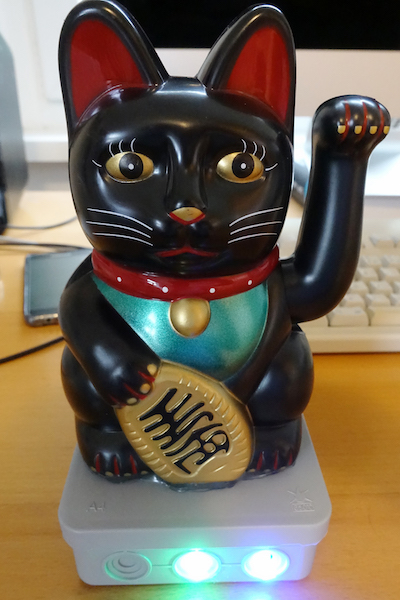
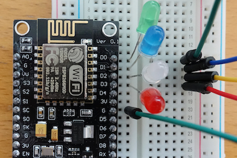
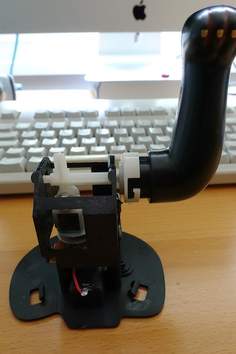

# IoT Maneki-Neko

With `iot-maneki-neko.ino` and an **ESP8266** (like the NodeMCU Lua Lolin V3 Module) you can make a Maneki-Neko (Beckoning Cat, Luck Cat, Winkekatze) to an IoT Maneki-Neko.
Let's make a thing to an thing with internet or internet of things.
Inspired by the Chaos Communication Camp Project [Winkekatze](https://events.ccc.de/camp/2015/wiki/Projects:Winkekatze).

## Demo

Control my IoT Maneki-Neko: [🐱 iotkatze](https://www.nkn-it.de/iot-maneki-neko/)

## Set-Up

You need an ESP8266 and a Maneki-Neko.
Open `iot-maneki-neko.ino` with the Arduino IDE and adjust the configuration:

* `cat_name` : Your cat name
* `ssid`     : Your WiFi SSID
* `password` : Your WiFi password

Upload `iot-maneki-neko.ino` to your ESP8266.

Connect `D0` and `D1` each with one LED.

Connect `D2` to the motor (magnet).

## Remote Control

Open `index.html` with your favorite text editor and adjust the configuration:

* `cat_name` : Your cat name

Open `index.html` with your favorite web browser and control your IoT Maneki-Neko.

With the Perl script `wave.pl` you can also control your cat. 
With `mqtt-subscribe.pl` you can see all commands of all IoT cats.

## How does it work?

* The ESP8266 connects itself via WiFi and gets by DHCP an IP address.
* The computer connects to the MQTT broker `iot.eclipse.org`.
	* MQTT is explained in [Wikipedia](https://en.wikipedia.org/wiki/MQTT).
* The MQTT topic `winkekatze/YOUR-CAT-NAME/command` is subscribed.
* When the text `wave` appears, the cat starts to wave.

## Help 👍

If you have found a bug (English is not my mother tongue) or have any improvements, send me a pull request.
